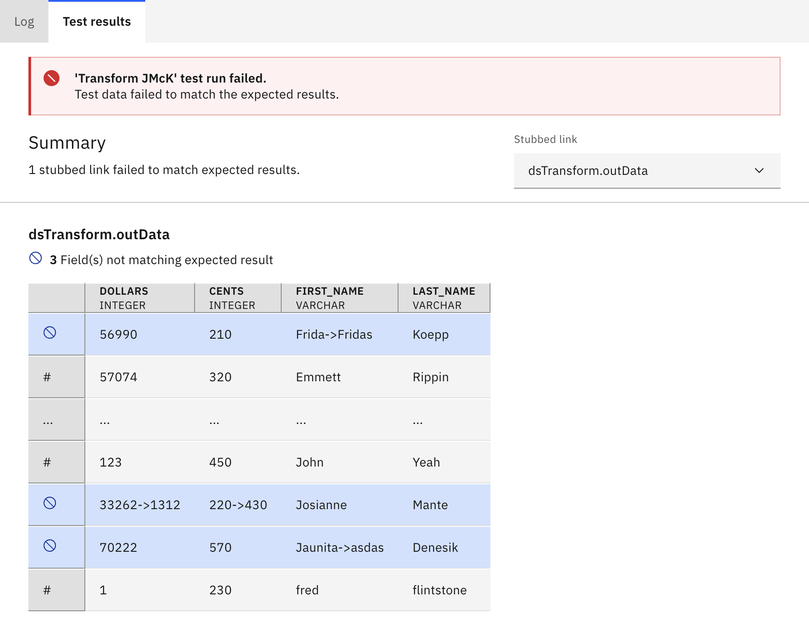

# Verifying test results

You can verify DataStage test results either from the CPD Cluster home page, the DataStage designer canvas, or the DataStage test case editor.

## From the CPD Cluster home page

1. Open an existing project and select the **Jobs** tab.
1. Click the name of the test case you wish to inspect.  This will display the job details panel.
1. Click the timestamp of a test to see its results.

## From the DataStage canvas

1. Open an existing DataStage flow for which you have created a test case.
1. Click the **Test cases** icon to open up the test cases side panel.
1. Click the timestamp of a test to see its results.

## From the DataStage test case editor

1. Open an existing test case and select the **Test history** tab.
1. Click the timestamp of a test to see its results.

On the resulting **Run details** page select the **Test results** tab to see details about your test outcome.  Successful tests will present a simple acknowledgement message:

Test case errors will produce a **difference report** detailing how the expected and actual results differ from one another.

## The difference report

The difference report contains rows and columns from the tables being compared. Similar to the textual output of the unix `diff` command, there is flexibility in what data is displayed and what is omitted.

- A column or row that is common to the tables being compared should appear at most once.
- Any column or row containing a modified cell should be included in the diff, and the modified cell should be represented using the procedure in Expressing a modified cell value.
- Columns or rows that are present in one table and not in the other should be included in the diff.
- Columns or rows that are unchanged and unneeded for context may be omitted at DataStage's discretion.
- Omitted blocks of rows or columns should be marked with a row/column full of “…” cells.

In addition, the difference report contains the following special rows and columns:

- The action column. This is always present, and is the first column in the difference report.
- A header row with column names. This row can be recognized since it will have the tag @@ in the action column.
- A schema row that is needed when the column structure differs between tables. This row can be recognized since it will have the tag ! in the action column.
